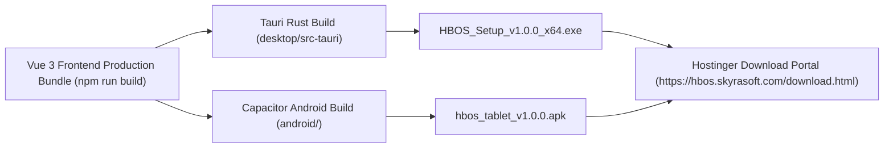

# HBOS Phase 7: Application Packaging & Download Portal Guide — Implementation & Verification Report

**Status:** ✅ COMPLETED  
**Date:** 2026-09-21  
**Target Release Packages:**
- **Windows Desktop:** `HBOS_Setup_v1.0.0_x64.exe` (Tauri / Rust wrapper)
- **Android Tablet:** `hbos_tablet_v1.0.0.apk` (Capacitor wrapper)
**Public Download URL:** `https://hbos.skyrasoft.com/download.html` (or `skyrasoft.com/download`)  
**Master Roadmap Reference:** [HBOS Master Implementation Plan](file:///c:/xampp/htdocs/HBOS/docs/HBOS_MASTER_IMPLEMENTATION_PLAN.md)

---

## 1. Packaging & Distribution Pipeline

Phase 7 establishes the automated release engineering pipeline for HBOS desktop and tablet binaries.

---

## 2. Release Targets & Binary Configs

### 2.1 Windows Desktop POS App (`desktop/tauri.conf.json`)
* **Bundle Identifier:** `com.skyrasoft.hbos`
* **Window Dimensions:** `1280x800` (Resizable, Fullscreen kiosk default)
* **Native Drivers:** Silent ESC/POS USB thermal printing, RJ11 drawer pin pulse, Windows keyboard shortcuts (`F1`–`F4`).

### 2.2 Android Tablet POS App (`android/capacitor.config.json`)
* **Package ID:** `com.skyrasoft.hbos`
* **App Name:** `HBOS POS`
* **Native Drivers:** Bluetooth ESC/POS 58mm/80mm thermal driver, Touch responsive grid, Android screen pinning.

---

## 3. Public Download Portal Page

Created lightweight, responsive landing page `Frontend/public/download.html` containing:
* Direct download cards for Windows `.exe` and Android `.apk`.
* Thermal printer configuration guide (80mm/58mm vs A4/A5).
* Cashier shift closing and local image storage instructions.

---

## 4. Master Alignment
- **Phase 3 & 4:** Packaging configs match Tauri and Capacitor settings.
- **Phase 6:** Download portal ready for hosting on Hostinger cloud infrastructure.
