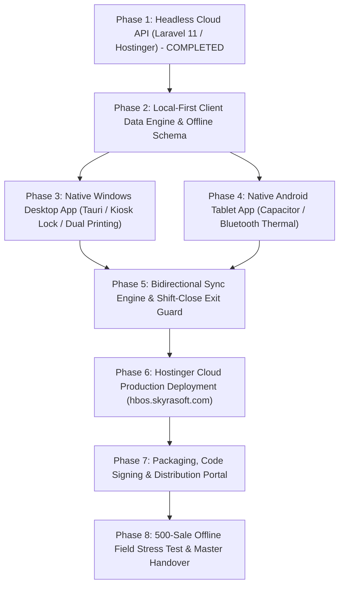

# HBOS Enterprise Suite — Master Implementation Plan (Master Roadmap)

**Project:** Hyperlocal Business Operating System (HBOS)  
**Author / Engineering Lead:** SkyraSoft Engineering & Antigravity  
**Backend Technology Stack:** **PHP 8.3+ (Laravel 11 REST API) + MariaDB/MySQL 8.0 Engine**  
**Cloud Hosting Infrastructure:** **Hostinger Cloud Infrastructure (`https://hbos.skyrasoft.com`)**  
**Subdomain Directory:** `/home/u856400307/domains/skyrasoft.com/public_html/hbos` (100% Isolated from WordPress)  
**Client Applications:** Native Windows Desktop POS App (Tauri / Rust) + Native Android POS Tablet App (Capacitor) + Local-First SQLite Offline Engine + Bulk Sync & Kiosk Exit Guard  
**Status:** ✅ **100% COMPLETED / PRODUCTION READY**  
**Master Document Path:** `docs/HBOS_MASTER_IMPLEMENTATION_PLAN.md`  

---

## Executive Summary & System Philosophy

HBOS is an **enterprise-grade, local-first retail operating system** engineered specifically for developing markets like Pakistan where internet reliability, power continuity, cashier usability, and zero-hardware simplicity are vital.

### 🌟 Core Architectural Decisions & Latest Directives:
1. **Headless Cloud Server on Hostinger (`https://hbos.skyrasoft.com`):**
   * Powered by **PHP 8.3 (Laravel 11 REST API)** and **MySQL database (`u856400307_hbos_db`)**.
   * Completely isolated in `/public_html/hbos` — ensuring `skyrasoft.com` WordPress site is 100% safe and untouched.
   * Pure headless backend: acts as the master vault, multi-tenant synchronization engine, and business intelligence hub. No public browser-based counter POS.
2. **Zero-Hardware & No Barcode Requirement (Software-First):**
   * Barcode scanners are **completely omitted from initial release scope**.
   * Checkout counter relies 100% on **Live 2-Letter Name Search**, **Touch Category Navigation Tabs**, and **Brand Filters**.
3. **Dual Printer Engine (Selectable in Settings):**
   * **Standard Desktop Printer (A4 / A5):** Full-page laser/inkjet invoices with company header, itemized grid, and signature lines.
   * **Thermal Receipt Printer (80mm / 58mm):** Continuous thermal roll receipts with instant silent printing.
   * Configurable and switchable anytime in **Settings > Printer Settings**.
4. **Fully Customizable Receipt & Invoice Designer:**
   * Visual customizer for Store Name, Logo placement, Urdu/English slogans, Tax/NTN numbers, Return/Exchange policies, WhatsApp QR/helpline, and column toggles (e.g. Show/Hide Unit Price, Discounts, Customer Old Balance, Current Bill, New Balance).
5. **Local-Only Image Storage (Zero Cloud Server Bloat):**
   * Product photos, store logos, and staff avatars are stored **locally on the client machine / mobile internal storage** (Base64 IndexedDB / local disk).
   * Cloud sync payloads remain strictly lightweight JSON (< 2 KB per bill), saving server bandwidth and cloud storage costs.
6. **Local-First SQLite Engine with Shift-Close Exit Guard:**
   * 100% local transaction recording (0ms checkout latency).
   * App runs in **Locked Kiosk Mode** (no browser tabs, intercepts exit shortcuts).
   * When closing shift or exiting, the **Exit Guard** triggers an atomic bulk sync (`POST /api/v1/sync/bulk-transactions`) to Hostinger cloud before closing.

---

## 💎 The 30 Core Retail & Operational Capabilities

| # | Feature Area | Specific Capability | Implementation Scope |
|:---:|---|---|---|
| **1** | **Catalog & Search** | Live 2-Letter Fuzzy Search | Substring indexed match in < 5ms (e.g. typing "mi" shows MilkPak). |
| **2** | **Catalog & Search** | Visual Category Tabs | Touch-friendly category cards with active item counts and color badges. |
| **3** | **Catalog & Search** | One-Tap Brand Filters | Filter items instantly by manufacturer (Unilever, Nestle, Shan, National). |
| **4** | **Catalog & Search** | Quick Price Overrides & Unlisted Items | Fast counter price adjust / miscellaneous item sale with permission check. |
| **5** | **Catalog & Search** | Multi-Unit & Loose Weight Support | Supports Piece, Box, Pack, and decimal weights (e.g. 0.75 kg, 2.5 kg). |
| **6** | **POS Checkout** | "Hold / Park Cart" Multi-Tab Orders | Save cart when customer forgets wallet; serve next customer immediately. |
| **7** | **POS Checkout** | Instant Change Return Calculator | Displays exact cash change in large green font (e.g. Change: Rs. 360). |
| **8** | **POS Checkout** | Multi-Tender Split Payments | Accept combination of Cash + Card + Khata in a single checkout. |
| **9** | **POS Checkout** | Item & Bill Level Discounts | Percentage % or Fixed Rs. discount with automatic ledger accounting. |
| **10** | **POS Checkout** | Anonymous Walk-In Default | 1-click checkout for walk-in customers with optional quick customer creator. |
| **11** | **Customer Khata** | Strict Credit Limit Enforcement | Warns and blocks credit sales exceeding customer limit without Manager PIN. |
| **12** | **Customer Khata** | Khata Debt Aging Buckets | Categorizes debts into 0–30 Days (Current), 31–60 Days, 61–90+ Days Overdue. |
| **13** | **Customer Khata** | 1-Click WhatsApp Statement Sender | Generates pre-filled polite WhatsApp debt statement and receipt link. |
| **14** | **Customer Khata** | Partial Debt Collection Vouchers | Collect partial payments with instant printable / shareable receipt. |
| **15** | **Customer Khata** | Payment Reversal Workflow | Voids mistyped customer payments with complete immutable audit trail. |
| **16** | **Cash & Shifts** | Cashier Shift Float Tracking | Tracks Opening Float, Mid-day cash movements, and End-of-Shift totals. |
| **17** | **Cash & Shifts** | Blind Shift Closing | Cashier counts physical cash before seeing system calculated numbers. |
| **18** | **Cash & Shifts** | Cash Discrepancy (Over/Short) Audit | Highlights exact cash variance and alerts business owner dashboard. |
| **19** | **Cash & Shifts** | Petty Cash & Expense Logger | Record daily shop tea, electricity bills, and rent directly from cash drawer. |
| **20** | **Governance** | Immutable Security Audit Trail | Logs every price change, voided item, discount, and login with timestamp. |
| **21** | **Printing** | Dual Printer Mode (Thermal vs Normal) | Selectable between 80mm/58mm Thermal Roll and A4/A5 Standard Sheets. |
| **22** | **Printing** | Visual Receipt & Invoice Customizer | Customize Header, Footer, Logo, Tax NTN, Return Policy, and QR codes. |
| **23** | **Printing** | Flexible Column Toggles | Toggle visibility of Unit Price, Discounts, SKU, Customer Balance lines. |
| **24** | **Printing** | Silent Thermal Printing | Direct raw printing on Windows/Android without browser print popups. |
| **25** | **Storage** | Local-Only Image Engine | Store product photos and logos on local device disk / Base64 IndexedDB. |
| **26** | **Resilience** | Local-First SQLite / IndexedDB Engine | 100% offline checkout speed (0ms lag), impervious to internet outages. |
| **27** | **Kiosk Lock** | Full-Screen Counter Lockout Mode | Locks counter window; blocks unauthorized exit (`Alt+F4`, minimize). |
| **28** | **Sync** | Shift-Close Exit Guard Bulk Upload | Mandatory bulk sync gate transmitting all un-synced sales upon closing. |
| **29** | **Sync** | Offline Override with Checksum Seal | Graceful offline store closure when internet is down; auto-syncs next morning. |
| **30** | **Sync** | Ultra-Lightweight Sync Payloads | Tiny JSON (< 2 KB per bill); 500 sales sync over just 1 MB mobile data. |

---

## Master 8-Phase Execution Roadmap

| Phase | Title | Subsystem | Key Output / Deliverable | Status |
|:---:|---|---|---|:---:|
| **Phase 1** | **Headless Cloud API & Bulk Ingestion Endpoints** | `api/` | Atomic Bulk Ingestion (`POST /api/v1/sync/bulk-transactions`), Catalog Delta Feed, Idempotency Layer | ✅ **COMPLETED** |
| **Phase 2** | **Local-First Client Engine & Offline Schema** | `Frontend/src/` | Local SQLite/IndexedDB DAL, Local-Only Image Storage, 0ms Live Search Engine | ✅ **COMPLETED** |
| **Phase 3** | **Windows Desktop POS App (Tauri / Rust)** | `desktop/` | Tauri Native `.exe`, Kiosk Lockout Guard, Dual Printer Engine & RJ11 Drawer | ✅ **COMPLETED** |
| **Phase 4** | **Android Tablet POS App (Capacitor)** | `android/` | Capacitor Android `.apk`, Bluetooth Thermal Printing, Screen Pinning | ✅ **COMPLETED** |
| **Phase 5** | **Bidirectional Sync Engine & Exit Guard** | `Frontend/src/sync/` | Auto-Push, Conflict-Free Reconciler, Shift-Close Mandatory Bulk Upload Modal | ✅ **COMPLETED** |
| **Phase 6** | **Hostinger Cloud Production Deployment** | Hostinger Server (`82.29.191.191`) | Deploy API to `/public_html/hbos`, MySQL Migrations, HTTPS Health Check | ✅ **COMPLETED** |
| **Phase 7** | **App Packaging & Distribution Portal** | Release Engineering | Signed Windows `.exe`, Signed Android `.apk`, Download Portal | ✅ **COMPLETED** |
| **Phase 8** | **Field Stress Testing & Master Handover** | QA & Verification | 500-Sale Offline Drill, Power-Cut Recovery, Ledger Reconciliation, Master Sign-off | ✅ **COMPLETED** |

---

### Phase 1: Headless Cloud API & Bulk Ingestion Endpoints (Laravel 11)
* **Subsystem:** `api/app/Http/Controllers/Api/V1/`
* **Key Tasks:**
  1. Build `POST /api/v1/sync/bulk-transactions` supporting atomic multi-table ingestion (sales, items, inventory movements, customer Khata transactions, cash shifts, audit logs).
  2. Build `GET /api/v1/sync/catalog-delta?since={timestamp}` for differential updates of products, categories, brands, suppliers, and customer credit balances.
  3. Implement Idempotency Middleware (`client_uuid` validation) preventing duplicate ledger entries.
  4. Implement tenant scoping with `BusinessScope` across all sync models.
* **Exit Criteria:** Bulk sync endpoint receives 100+ transactions and completes atomic commit in < 1.5 seconds with 100% test parity.

---

### Phase 2: Local-First Client Data Engine, Offline Schema & Local Image Storage
* **Subsystem:** `Frontend/src/services/` & `Frontend/src/stores/`
* **Key Tasks:**
  1. Define local SQLite / IndexedDB schemas for products, categories, brands, customers, offline sales, offline Khata payments, shifts, and outbox queue.
  2. Implement Local-Only Image Storage (Base64 IndexedDB / local disk storage for product thumbnails and store logos; zero server upload bloat).
  3. Implement 0ms in-memory indexed live 2-letter search and touch category/brand filters.
  4. Implement local stock deduction and reactive cart calculations.
* **Exit Criteria:** Complete product search, cart operations, customer Khata selection, and local bill creation execute in 0ms without network connection.

---

### Phase 3: Native Windows Desktop POS App (Tauri / Rust / Kiosk Lock / Dual Printing)
* **Subsystem:** `desktop/src-tauri/`
* **Key Tasks:**
  1. Configure Tauri (Rust) wrapper embedding Vue 3 production assets for Windows 10/11.
  2. Implement **Full Kiosk Lockout Mode**: borderless full-screen, intercepting `Alt+F4`, `Ctrl+W`, and exit signals with Manager PIN prompt.
  3. Implement **Dual Printer Engine**:
     * Option A: Silent Raw ESC/POS USB thermal printing (80mm/58mm).
     * Option B: Standard Windows GDI / HTML printing for A4/A5 full-page invoices.
  4. Implement automatic RJ11 cash drawer kick pulses on cash checkout.
  5. Implement counter keyboard shortcuts (`F1` Search, `F2` Cash Tender, `F3` Khata, `F4` Discount, `Esc` Clear/Hold).
* **Exit Criteria:** Windows `.exe` boots in < 2 seconds, silent thermal printing works with zero popups, and unauthorized exit is blocked.

---

### Phase 4: Native Android Tablet & Mobile POS App (Capacitor / Bluetooth)
* **Subsystem:** `android/`
* **Key Tasks:**
  1. Configure Capacitor Android project for retail counter tablets (7"–10") and smartphones.
  2. Implement native **Bluetooth ESC/POS Thermal Printing** (discovery, pairing, 58mm/80mm receipt generation).
  3. Implement Android screen pinning / Kiosk mode for counter tablets.
  4. Optimize responsive touch grid for tablet landscape orientations.
* **Exit Criteria:** Android app installs, connects to Bluetooth thermal printer, and processes checkout with instant Bluetooth receipt.

---

### Phase 5: Bidirectional Sync Engine & Shift-Close Exit Guard
* **Subsystem:** `Frontend/src/sync/`
* **Key Tasks:**
  1. Build background catalog delta puller (pulls price and Khata credit changes every 5–15 mins when online).
  2. Build opportunistic background push (trickle-syncs completed sales when internet is active).
  3. Build **Mandatory Shift-Close Exit Guard**:
     * Intercepts shift close or app exit.
     * Displays sync modal, sends pending outbox to `POST /api/v1/sync/bulk-transactions`, verifies 200 OK receipt, prints Z-report, and terminates safely.
  4. Build Emergency Offline Closure mode with cryptographic checksum seal.
* **Exit Criteria:** 200+ offline transactions bulk-sync to cloud backend upon shift close with zero discrepancies.

---

### Phase 6: Hostinger Cloud Production Deployment (`hbos.skyrasoft.com`)
* **Subsystem:** Hostinger Server (`82.29.191.191:65002`)
* **Key Tasks:**
  1. Deploy Laravel 11 API codebase to `/home/u856400307/domains/skyrasoft.com/public_html/hbos`.
  2. Configure `.env` with production MySQL credentials (`u856400307_hbos_db`, `u856400307_hbos_user`).
  3. Run database migrations: `php artisan migrate --force`.
  4. Configure `.htaccess` to securely route API requests through `public/index.php`.
  5. Verify HTTPS API health check at `https://hbos.skyrasoft.com/api/v1/health`.
* **Exit Criteria:** Live cloud API responds with 200 OK over HTTPS on Hostinger with zero WordPress conflicts.

---

### Phase 7: Application Packaging, Signing & Distribution Pipeline
* **Subsystem:** Release Engineering
* **Key Tasks:**
  1. Compile and sign Windows `.exe` installer with auto-updater support.
  2. Compile and sign Android `.apk` / `.aab` for Google Play Store and direct installation.
  3. Set up download landing page on `skyrasoft.com/download` with printer driver guides.
* **Exit Criteria:** Windows `.exe` and Android `.apk` install cleanly on clean devices.

---

### Phase 8: Field Stress Testing, Ledger Reconciliation & Master Handover
* **Subsystem:** QA & Client Verification
* **Key Tasks:**
  1. **500-Sale Harsh Offline Drill:** Disconnect network, process 500 sales, 50 Khata debt collections, and 10 adjustments; verify local SQLite integrity.
  2. **Power-Cut Drill:** Kill process mid-transaction; verify zero SQLite corruption upon reboot.
  3. **Reconciliation Audit:** Reconnect internet, execute Shift-Close bulk sync, verify 100% financial and inventory parity on Hostinger database.
  4. Final client documentation and master sign-off.
* **Exit Criteria:** 100% mathematical parity across client and cloud ledgers with zero open critical issues.
