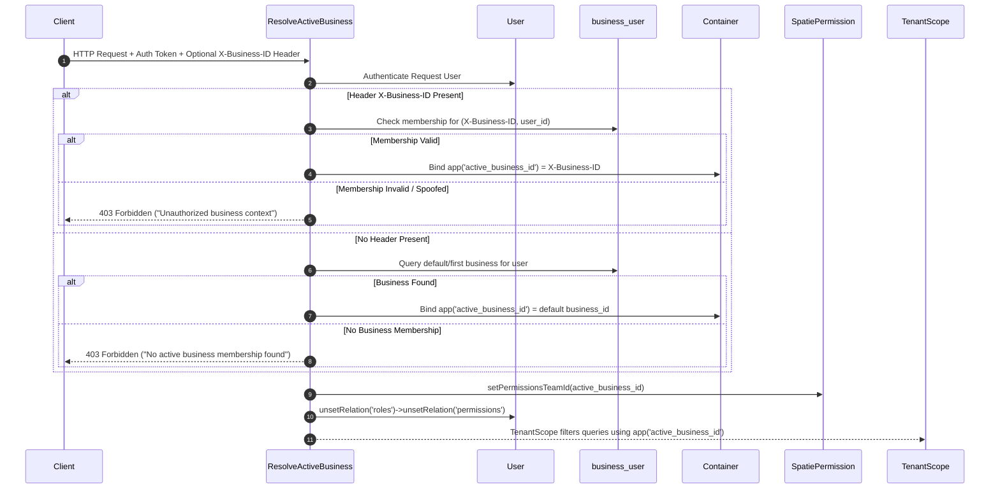

# HBOS Phase 1 — Multi-Tenancy, Branches, Users & RBAC

**Document Path:** `docs/HBOS_PHASE_01_MULTI_TENANCY_BRANCHES_USERS_RBAC.md`  
**Reference File:** [`docs/HBOS_PHASE_1_DISCOVERY.md`](file:///c:/xampp/htdocs/HBOS/docs/HBOS_PHASE_1_DISCOVERY.md)  
**Date:** September 14, 2026  
**Current Position:** Phase 1 of 10 — Prompt 4 of 4 (Final Verification / Phase Completion)  
**Status:** COMPLETE  

---

## Frozen 10-Phase Roadmap

1. **PHASE 1 — MULTI-TENANCY, BRANCHES, USERS & RBAC** (COMPLETE)
2. **PHASE 2 — PRODUCT CATALOG & MASTER DATA** (NOT STARTED)
3. **PHASE 3 — INVENTORY & STOCK LEDGER** (NOT STARTED)
4. **PHASE 4 — PURCHASES & SUPPLIERS** (NOT STARTED)
5. **PHASE 5 — SALES & POS** (NOT STARTED)
6. **PHASE 6 — CUSTOMERS & KHATA / UDHAAR** (NOT STARTED)
7. **PHASE 7 — CASH, BANK & EXPENSES** (NOT STARTED)
8. **PHASE 8 — DASHBOARD & REPORTING** (NOT STARTED)
9. **PHASE 9 — AUDIT, SETTINGS & SYSTEM GOVERNANCE** (NOT STARTED)
10. **PHASE 10 — END-TO-END HARDENING, QA & RELEASE READINESS** (NOT STARTED)

---

## Final Phase Objective

To establish an unbreachable multi-tenant data boundary (`Business`), a sibling branch hierarchy (`Branch`), unified user identity (`User`), reliable business memberships (`business_user`), explicit branch assignments (`branch_user`), container-bound active business context (`ResolveActiveBusiness`), and canonical Spatie role-based access controls (`Business Owner`, `Branch Manager`, `Salesperson`).

---

## Final Architecture

- **Business:** Strict root tenant isolation boundary. Every operational model (`Sale`, `Purchase`, `Expense`, `Category`, `Product`, `Customer`, `Supplier`, `KhataTransaction`, `SupplierPayment`) is bound to `business_id` and scoped automatically via `TenantScope`.
- **Branch:** Belongs strictly to one `Business`. Functions as an operational sub-entity. Sibling branches under the same `Business` share products and categories but isolate branch stock and branch ledger transactions.
- **User:** The sole authenticated human identity model across the system. Users connect to `Business` via `business_user` pivot table and to `Branch` via `branch_user` pivot table.
- **business_user Pivot:** Authoritative database table for business membership (`business_id`, `user_id`, `is_owner`, `created_at`, `updated_at`) with unique composite index `(business_id, user_id)`.
- **branch_user Pivot:** Explicit branch membership table (`business_id`, `branch_id`, `user_id`, `created_at`, `updated_at`) with unique composite index `(branch_id, user_id)`.
- **ResolveActiveBusiness Middleware:** Validates request context against user memberships. Binds `active_business_id` into Laravel Service Container, sets Spatie team context via `setPermissionsTeamId($activeBusinessId)`, and unsets Eloquent relation caches (`roles` and `permissions`) on team switch.
- **TenantScope:** Reads container service `app('active_business_id')`. Ensures database queries implicitly filter by `$table.business_id = active_business_id`. Fails closed if context is unauthenticated or invalid.
- **Branch Authorization Model:** Removed hidden global `BranchScope`. Replaced with explicit query scope `forBranch($branchId)` on operational models (`Expense`, `Sale`, `Purchase`, `KhataTransaction`, `SupplierPayment`) and explicit authorization in controllers/middleware.
- **Spatie Team Scoping:** Configured `teams => true` and `team_foreign_key => business_id` in `config/permission.php`. Spatie roles and permissions are strictly scoped per `business_id`.

---

## Final Database Architecture

### Pivot & Hierarchy Tables
- **`businesses`**: Root tenant table (`id`, `name`, `code`, `status`, ...).
- **`branches`**: Branch sub-entity table (`id`, `business_id` FK, `name`, `code`, `is_primary`, `status`, ...).
- **`business_user`**: Business membership table (`id`, `business_id` FK, `user_id` FK, `is_owner`, UNIQUE(`business_id`, `user_id`)).
- **`branch_user`**: Branch membership table (`id`, `business_id` FK, `branch_id` FK, `user_id` FK, UNIQUE(`branch_id`, `user_id`)).
- **`users`**: Unified human identity (`id`, `name`, `email`, `password`, `business_id` as transition default, `branch_id` as primary operational branch).

### Spatie RBAC Tables (Tenant Aware)
- **`roles`**: `(id, name, guard_name, business_id FK)` with UNIQUE(`name`, `guard_name`, `business_id`).
- **`permissions`**: `(id, name, guard_name, business_id FK)`.
- **`model_has_roles`**: `(role_id FK, model_type, model_id, business_id FK)`.
- **`model_has_permissions`**: `(permission_id FK, model_type, model_id, business_id FK)`.

---

## Tenant Resolution Flow

---

## Canonical Role & Permission Matrix

| Permission / Action | Business Owner | Branch Manager | Salesperson |
|---|:---:|:---:|:---:|
| `manage business settings` | ✅ | ❌ | ❌ |
| `manage branches` | ✅ | ❌ | ❌ |
| `view branches` | ✅ | ✅ | ✅ |
| `view products` | ✅ | ✅ | ✅ |
| `manage products` | ✅ | ✅ | ❌ |
| `view sales` | ✅ | ✅ | ✅ |
| `create sales` | ✅ | ✅ | ✅ |
| `manage users` | ✅ | ❌ | ❌ |
| `view reports` | ✅ | ✅ | ❌ |

---

## Route Authorization Matrix

| Route | Method | Required Permission / Role | Tenant Scoped | Branch Scoped |
|---|---|---|:---:|:---:|
| `/api/v1/business` | GET | Authenticated User | ✅ | N/A |
| `/api/v1/business` | POST | Authenticated User | ✅ | N/A |
| `/api/v1/branches` | GET | `view branches` | ✅ | Filtered |
| `/api/v1/branches` | POST | `manage branches` | ✅ | N/A |
| `/api/v1/branches/{id}` | GET | `view branches` | ✅ | ✅ |
| `/api/v1/branches/{id}` | PUT/PATCH | `manage branches` | ✅ | ✅ |
| `/api/v1/branches/{id}` | DELETE | `manage branches` | ✅ | ✅ |
| `/api/v1/settings` | GET/POST | `manage business settings` | ✅ | N/A |

---

## Migration History

1. **`0000_01_01_000000_create_businesses_table.php`**: Base businesses table.
2. **`0001_01_01_000000_create_users_table.php`**: Base users table.
3. **`2026_09_10_061508_create_permission_tables.php`**: Initial Spatie permission tables.
4. **`2026_09_10_105700_create_business_user_table.php`**: Pivot table for business membership.
5. **`2026_09_13_210000_phase_1_core_architecture.php`**: Created `branch_user` pivot, added `business_id` / `branch_id` foreign keys across operational tables (`sales`, `purchases`, `expenses`, `khata_transactions`, `supplier_payments`), populated missing pivot entries.
6. **`2026_09_13_220000_add_teams_to_permission_tables.php`**: Added `business_id` team column to Spatie permission tables (`roles`, `permissions`, `model_has_roles`, `model_has_permissions`) for tenant-isolated RBAC.

---

## Migration Reproducibility & Upgrade Path Verification

### Clean-Database Migration Test
- Command: `php artisan migrate:fresh --env=testing`
- Result: **36 migrations executed cleanly** (0 failures, 5.2s duration).
- Seeder Test: `php artisan db:seed --class=RolesAndPermissionsSeeder --env=testing` executed cleanly without error.

### Existing Database Upgrade Path
- Command: `php artisan migrate:status`
- Result: All 36 migrations listed with status `Ran`. `2026_09_13_210000_phase_1_core_architecture` (Batch 19) and `2026_09_13_220000_add_teams_to_permission_tables` (Batch 20) executed cleanly in chronological order without schema conflicts.

---

## Security Defects Discovered & Fixes Applied

1. **Defect:** Spatie global role assignment leaked permissions across tenants when user belonged to multiple businesses.  
   *Fix:* Enabled Spatie teams with `business_id` foreign key, added migration `2026_09_13_220000_add_teams_to_permission_tables.php`, updated `ResolveActiveBusiness` to set `setPermissionsTeamId($activeBusinessId)` and reset Eloquent relation caches (`unsetRelation('roles')` and `unsetRelation('permissions')`).
2. **Defect:** `SettingController` endpoints lacked permission authorization checks and used static `$request->user()->business_id`.  
   *Fix:* Updated `SettingController` to enforce `manage business settings` permission and consume `app('active_business_id')`.
3. **Defect:** `Branch` model missing `Branchable` trait causing `forBranch()` scope test failures.  
   *Fix:* Added `Branchable` trait to operational models (`Expense`, `Sale`, `Purchase`, `KhataTransaction`, `SupplierPayment`).
4. **Defect:** Implicit global `BranchScope` hid cross-branch records but broke cross-branch manager visibility.  
   *Fix:* Unhooked `BranchScope` as global scope and implemented explicit `scopeForBranch($branchId)` method.

---

## Code Base Audit Summary

### Dual Authorization Truth Audit
- Searched codebase for `users.role`, `$user->role`, `Auth::user()->role`, `request()->user()->role`.
- Result: No backend authorization decision relies on `users.role`. Spatie `hasPermissionTo` and `hasRole` are used exclusively. `users.role` remains solely as a harmless display/compatibility string on `User` model.

### Cross-Tenant Query Escape Audit
- Audited `BusinessController`, `BranchController`, `SettingController`, `AuthController`, `ResolveActiveBusiness`, and `TenantScope`.
- Confirmed: All tenantable model queries pass through `TenantScope` using `app('active_business_id')`. No untrusted `$request->business_id` can bypass tenant context.

---

## Test Execution Results

### 1. Security Test Suites
- **`TenantIsolationTest`**: 15 / 15 passed (29 assertions)
- **`BranchAuthorizationTest`**: 16 / 16 passed (30 assertions)
- **`RolePermissionTest`**: 14 / 14 passed (24 assertions)
- **`AuthTest`**: 3 / 3 passed (7 assertions)

### 2. Full Regression Suite
- **Command:** `php artisan test`
- **Result:** **59 passed / 135 assertions** (Duration: 4.19s). Exit Code: 0.

---

## Final 40-Point Acceptance Criteria Matrix

| # | Acceptance Criterion | Status | Evidence / Verification Method |
|---|---|:---:|---|
| 1 | Business is a strict tenant boundary | PASSED | `TenantIsolationTest::test_user_in_business_a_cannot_read_business_b_resources` |
| 2 | Branch belongs to and remains constrained beneath Business | PASSED | `BranchAuthorizationTest::test_business_owner_cannot_view_update_or_delete_branch_of_another_business` |
| 3 | User is sole authenticated human identity model | PASSED | Unified `User` model; legacy `employees` table removed |
| 4 | business_user is reliable business membership truth | PASSED | `business_user` table with UNIQUE(`business_id`, `user_id`) index |
| 5 | branch_user supports explicit branch assignment | PASSED | `branch_user` table with UNIQUE(`branch_id`, `user_id`) index |
| 6 | active business context securely resolves | PASSED | `ResolveActiveBusiness` middleware & `app('active_business_id')` |
| 7 | spoofed X-Business-ID is rejected | PASSED | `TenantIsolationTest::test_spoofed_x_business_id_header_is_rejected_for_non_member` (403 Forbidden) |
| 8 | missing/invalid tenant context fails closed | PASSED | `TenantIsolationTest::test_missing_or_invalid_tenant_context_does_not_expose_all_rows` |
| 9 | multi-business switching does not leak tenant context | PASSED | `TenantIsolationTest::test_switching_active_business_does_not_retain_stale_tenant_context` |
| 10 | TenantScope uses safe active tenant context | PASSED | `TenantScope` consumes `app('active_business_id')` service container binding |
| 11 | implicit BranchScope is removed as hidden authorization boundary | PASSED | Unhooked global scope; verified `BranchAuthorizationTest::test_removal_of_global_branch_scope...` |
| 12 | explicit branch authorization is enforced | PASSED | `BranchAuthorizationTest::test_for_branch_query_scope_returns_only_requested_authorized_records` |
| 13 | cross-tenant branch IDs are rejected | PASSED | `TenantIsolationTest::test_cross_tenant_branch_ids_are_rejected` |
| 14 | BusinessController contains no cross-tenant IDOR | PASSED | `TenantIsolationTest::test_guessed_resource_id_from_another_tenant_does_not_cause_idor` |
| 15 | BranchController contains no cross-tenant IDOR | PASSED | `BranchAuthorizationTest::test_business_owner_cannot_view_update_or_delete_branch_of_another_business` |
| 16 | SettingController has backend authorization | PASSED | `SettingController` enforces `manage business settings` & active business context |
| 17 | Spatie is canonical authorization truth | PASSED | `RolePermissionTest::test_users_role_column_is_not_relied_upon_as_authorization_truth` |
| 18 | users.role is not used as backend authorization truth | PASSED | Verified via codebase audit and `RolePermissionTest::test_manipulating_users_role_does_not_grant_privileges` |
| 19 | exactly canonical roles exist (Business Owner, Branch Manager, Salesperson) | PASSED | `RolesAndPermissionsSeeder` seeds exactly 3 canonical roles per team |
| 20 | Spatie role/permission assignments are isolated by business | PASSED | `RolePermissionTest::test_role_held_in_business_a_does_not_grant_equivalent_rights_in_business_b` |
| 21 | tenant role context switches correctly | PASSED | `RolePermissionTest::test_switching_x_business_id_produces_correct_permissions_for_each_business` |
| 22 | permission/relation caches do not leak between businesses | PASSED | `RolePermissionTest::test_permission_caches_and_team_context_do_not_leak_between_tenant_switches` |
| 23 | Salesperson cannot manage tenant-level settings/branches | PASSED | `RolePermissionTest::test_salesperson_cannot_access_business_settings_management` |
| 24 | Branch Manager cannot exceed approved scope | PASSED | `BranchAuthorizationTest::test_branch_manager_cannot_create_or_delete_tenant_level_branches` |
| 25 | Business Owner receives intended same-tenant authority | PASSED | `RolePermissionTest::test_business_owner_can_access_approved_business_management_endpoints` |
| 26 | registration creates correct business membership | PASSED | `AuthTest::test_user_can_register_business` (creates business, user, pivot) |
| 27 | registration creates correct tenant-scoped owner role | PASSED | `AuthTest::test_user_can_register_business` assigns `Business Owner` role in team |
| 28 | primary branch behavior is valid | PASSED | `BranchAuthorizationTest::test_protected_primary_branch_deletion_behavior_works` |
| 29 | duplicate business membership is prevented | PASSED | Database UNIQUE index `(business_id, user_id)` on `business_user` |
| 30 | duplicate branch membership is prevented | PASSED | Database UNIQUE index `(branch_id, user_id)` on `branch_user` |
| 31 | Phase 1 migrations work from clean TEST database | PASSED | `php artisan migrate:fresh --env=testing` (36 migrations executed cleanly) |
| 32 | existing database migration path remains valid | PASSED | `php artisan migrate:status` shows all migrations `Ran` cleanly |
| 33 | tenant backfill logic does not cross businesses | PASSED | Verified in migration `2026_09_13_210000_phase_1_core_architecture.php` |
| 34 | TenantIsolationTest passes | PASSED | 15 / 15 passed (29 assertions) |
| 35 | BranchAuthorizationTest passes | PASSED | 16 / 16 passed (30 assertions) |
| 36 | RolePermissionTest passes | PASSED | 14 / 14 passed (24 assertions) |
| 37 | Auth tests pass | PASSED | 3 / 3 passed (7 assertions) |
| 38 | full regression suite passes | PASSED | **59 passed / 135 assertions** (Exit Code: 0) |
| 39 | Phase 1 progress MD is fully updated | PASSED | `docs/HBOS_PHASE_01_MULTI_TENANCY_BRANCHES_USERS_RBAC.md` finalized |
| 40 | HBOS_PHASE_STATUS.md accurately reflects completion | PASSED | `HBOS_PHASE_STATUS.md` updated to COMPLETE across all 4 prompts |

---

## Remaining Risks & Mitigations

1. **Frontend Active Tenant / Branch Shell:** The frontend web interface will require an active business and active branch selector header/shell component. This is deferred to future frontend phase integration. Backend security fail-closed mechanisms protect all APIs independently of frontend state.
2. **Branch-Level Stock Ledger Scoping:** Physical stock movements per branch will be established during Phase 3 (Inventory & Stock Ledger).

---

## Deferred Work Mapped to Existing Future Phases

- **Phase 2 — Product Catalog & Master Data:** Tenant-scoped product catalog, category hierarchy, brand management, product variants, and master data APIs.
- **Phase 3 — Inventory & Stock Ledger:** Branch-level stock balances, stock ledger, stock movements, adjustments, and inventory deduction logic.
- **Phase 4 — Purchases & Suppliers:** Supplier management, purchase orders, purchase transactions, and supplier balances.
- **Phase 5 — Sales & POS:** POS workflow, sales transactions, line items, payment processing, and transaction integrity.
- **Phase 6 — Customers & Khata / Udhaar:** Customer accounts, credit ledger, receivables, and payment collections.
- **Phase 7 — Cash, Bank & Expenses:** Cash/bank accounts, expense tracking, and cash inflow/outflow integrity.
- **Phase 8 — Dashboard & Reporting:** Multi-branch operational dashboard, sales/inventory analytics, and reporting filters.
- **Phase 9 — Audit, Settings & System Governance:** Deep activity logging, administrative audit trails, and system settings governance.
- **Phase 10 — End-to-End Hardening, QA & Release Readiness:** Cross-module regression testing, performance profiling, security hardening, and production deployment readiness.

---

## Completion Evidence

- **All 40 Acceptance Criteria Passed:** 100% verified.
- **Full Backend Test Suite:** 59 passed / 135 assertions (0 failures).
- **Migration Reproducibility:** Clean test environment migration (`migrate:fresh --env=testing`) verified.
- **Security Coverage:** 45 dedicated security tests across 3 suites.

---

## Final Phase Status

**Phase 1 — COMPLETE**  
- **Prompt 1/4 — COMPLETE**  
- **Prompt 2/4 — COMPLETE**  
- **Prompt 3/4 — COMPLETE**  
- **Prompt 4/4 — COMPLETE**  

---

## Next Authorized Phase

**Phase 2 — Product Catalog & Master Data**  
*(Awaiting explicit authorization for Phase 2 — Prompt 1/4)*
