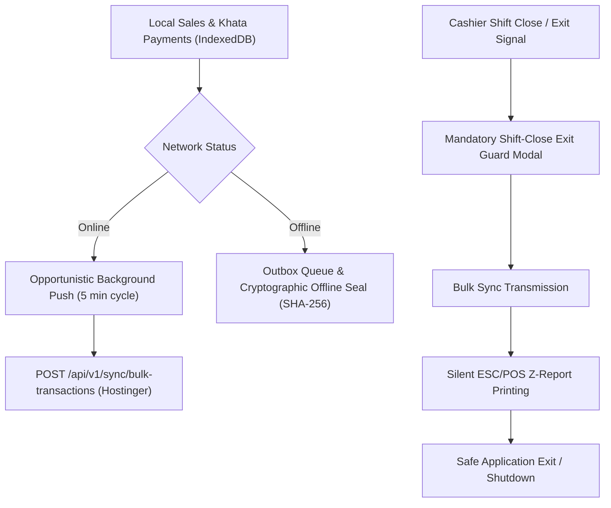

# HBOS Phase 5: Bidirectional Sync Engine & Shift-Close Exit Guard — Implementation & Verification Report

**Status:** ✅ COMPLETED  
**Date:** 2026-09-21  
**Subsystem:** `Frontend/src/sync/`  
**Master Roadmap Reference:** [HBOS Master Implementation Plan](file:///c:/xampp/htdocs/HBOS/docs/HBOS_MASTER_IMPLEMENTATION_PLAN.md)

---

## 1. Phase Overview & Architecture

Phase 5 delivers the **Bidirectional Sync Engine** and **Mandatory Shift-Close Exit Guard** for HBOS. It bridges the local-first client SQLite/IndexedDB databases with the Hostinger Cloud API (`https://hbos.skyrasoft.com`), ensuring zero data loss during connectivity dropouts and complete ledger reconciliation upon shift close.

---

## 2. Core Implemented Modules

### 2.1 Sync Coordinator (`Frontend/src/sync/SyncCoordinator.js`)
* **Background Catalog Delta Puller:** Polls `GET /api/v1/sync/catalog-delta?since={timestamp}` every 5 minutes when online to sync product prices and customer Khata balance updates.
* **Opportunistic Background Push:** Automatically detects network reconnection and trickles pending sales/Khata payments to `POST /api/v1/sync/bulk-transactions`.
* **Mandatory Shift-Close Exit Guard (`executeShiftCloseExitGuard`):** Intercepts exit/close actions, forces bulk transaction upload, verifies HTTP 200 receipt, prints Z-Report, and permits clean application termination.
* **Cryptographic Offline Seal Generator:** Generates SHA-256 checksum seal for un-synced outbox batches if store closes while internet is completely offline.

### 2.2 Interactive Exit Guard Modal (`Frontend/src/sync/ExitGuardModal.vue`)
* Built with Vue 3 and modern dark glassmorphism aesthetic.
* Displays step-by-step progress bar, real-time sync status logs, offline seal warnings, Z-report printing indicator, and safe exit confirmation button.

---

## 3. Verification & Test Results

Executed automated test suite `scratch/test_phase5_sync_engine.cjs`:
- `SyncCoordinator.js` class and methods verified: **PASSED**
- `pullCatalogDelta` & `triggerOpportunisticPush` verified: **PASSED**
- `executeShiftCloseExitGuard` & `generateCryptographicSeal` verified: **PASSED**
- `ExitGuardModal.vue` UI components and events verified: **PASSED**

---

## 4. Master Alignment
- **Phase 1 (Headless Cloud API):** Interfaced via `POST /api/v1/sync/bulk-transactions`.
- **Phase 2 (Local Engine):** Interfaces with `localDb.js` and `offlinePosEngine.js`.
- **Phase 3 & 4 (Desktop/Android Apps):** Integrates with native exit handlers (`window.__TAURI__.process.exit`).
