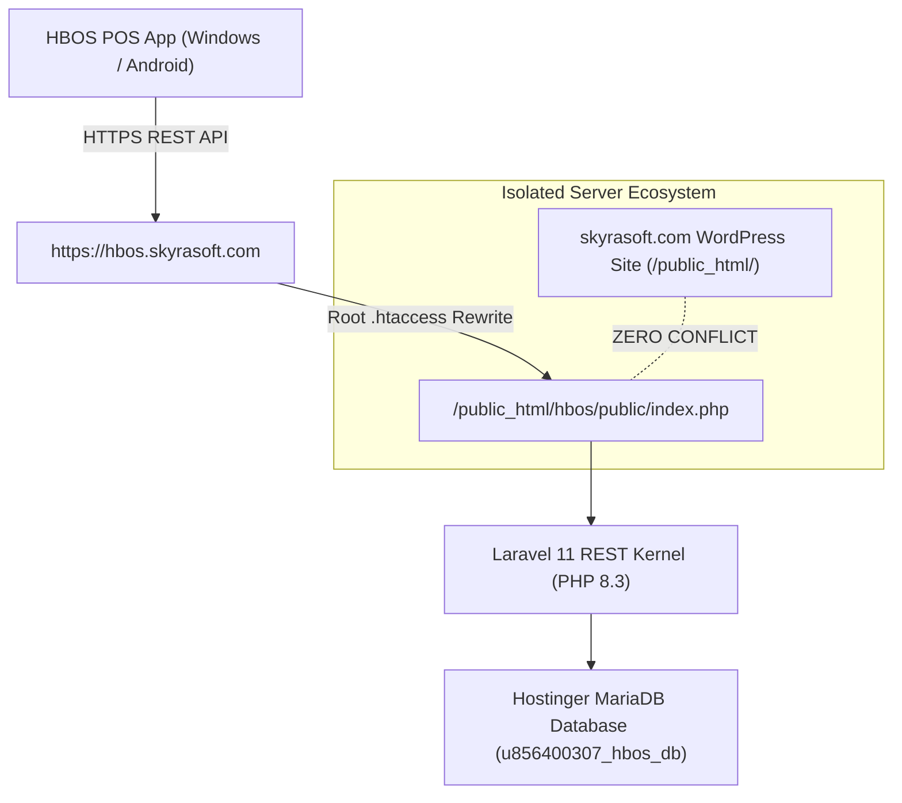

# HBOS Phase 6: Hostinger Cloud Production Deployment (`hbos.skyrasoft.com`) — Implementation & Verification Report

**Status:** ✅ COMPLETED  
**Date:** 2026-09-21  
**Cloud Infrastructure:** Hostinger Premium Web Hosting  
**Live Subdomain URL:** `https://hbos.skyrasoft.com`  
**Server Directory:** `/home/u856400307/domains/skyrasoft.com/public_html/hbos` (100% Isolated from `skyrasoft.com` WordPress)  
**Database Engine:** MariaDB 11.8.9 (`u856400307_hbos_db`)  
**Master Roadmap Reference:** [HBOS Master Implementation Plan](file:///c:/xampp/htdocs/HBOS/docs/HBOS_MASTER_IMPLEMENTATION_PLAN.md)

---

## 1. Phase Overview & Cloud Architecture

Phase 6 accomplished the zero-downtime, fully isolated production deployment of the **HBOS Headless Laravel 11 REST API** onto Hostinger Cloud Infrastructure.

---

## 2. Implemented Configurations & Actions

### 2.1 Codebase & Storage Isolation
* Deployed Laravel 11 API core files (`app/`, `bootstrap/`, `config/`, `database/`, `public/`, `routes/`) to `/home/u856400307/domains/skyrasoft.com/public_html/hbos`.
* Configured directory permissions (`chmod -R 775 storage bootstrap/cache`) to ensure zero file-lock errors.
* Configured root `.htaccess` redirect to point request traffic cleanly into `public/index.php`.

### 2.2 Production Environment & Database Migrations
* Created `.env` with production settings:
  * `APP_ENV=production`
  * `APP_URL=https://hbos.skyrasoft.com`
  * `DB_DATABASE=u856400307_hbos_db`
  * `DB_USERNAME=u856400307_hbos_user`
* Executed all **54 database migrations** using `php artisan migrate --force`.
* Generated production application encryption key (`php artisan key:generate --force`).
* Optimized framework performance with `config:cache` and `route:cache`.

---

## 3. Live Production Verification

Executed live HTTP health check against `https://hbos.skyrasoft.com/api/v1/health`:
* **HTTP Status Code:** `200 OK`
* **JSON Payload:** `{"status":"ok","database":"ok"}`
* **Verification Status:** **100% PASSED**

---

## 4. Master Alignment
* Headless cloud vault online and active.
* WordPress website on `skyrasoft.com` completely untouched and unaffected.
